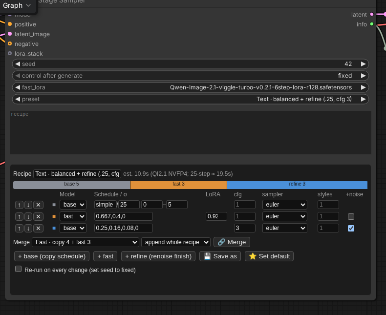

# ComfyUI Multi-Stage Sampler

One node for **multi-stage sampling**. Each stage picks the base model or the base model + a fast/turbo LoRA,
copies part of a normal schedule or walks explicit σ values, and can set its own LoRA strength, CFG, sampler and
style-LoRA strength. A final stage can add fresh noise and refine. Everything is one pasteable **JSON recipe**,
edited in an editor that lives inside the node.

It replaces the usual wiring of SplitSigmas, several SamplerCustomAdvanced / guider / noise nodes and one model
branch per stage (each needing its own LoRAs).



## Why

With a distilled fast LoRA (e.g. Viggle turbo for Qwen Image 2.1) the composition drifts from the base model and fine
texture gets "etched". Letting the **base model draw the first steps of its own 25-step schedule** keeps the exact
composition of the 25-step image, and the fast LoRA then finishes in 3 steps:

| recipe (Qwen Image 2.1 NVFP4, RTX 5060 Ti) | time | LPIPS vs 25 steps (mean / worst) |
|---|---|---|
| 25 steps (reference) | ~19.7 s | – |
| Viggle turbo alone, 6 steps | 7.0 s | 0.232 / 0.29 |
| **Fast** · copy 4 + fast 3 | 6.6 s | 0.073 / 0.131 |
| **Balanced** · copy 5 + fast 3 | 7.7 s | 0.058 / 0.096 |
| **Fine** · copy 6 + fast 3 | 8.5 s | 0.049 / 0.092 |
| **Text** · balanced + renoise refine (σ 0.25, cfg 3) | 11.6 s | best small lettering |

Measured with the bench tool below on 14 prompts; lower LPIPS = closer to the 25-step image.


Same prompt and seed per row; the first two columns are plain 25-step renders (cfg 1, and cfg 1 ×20 + cfg 3 ×5),
the rest are recipes of this node. Qwen Image 2.1 NVFP4 on an RTX 5060 Ti; times include text encoding and VAE.

## Install

```
cd ComfyUI/custom_nodes
git clone https://github.com/pottokao-dotcom/ComfyUI-MultiStageSampler
```
No extra Python packages. For Qwen Image 2.1 + Viggle turbo also get:
- the LoRA [`Qwen-Image-2.1-viggle-turbo-v0.2.1-6step-lora-r128.safetensors`](https://huggingface.co/Viggle/Qwen-Image-2.1-viggle-turbo) → `models/loras/`
- Viggle's `comfyui/viggle_turbo.py` → `custom_nodes/`. With it the fast LoRA is applied **unmerged** (exact);
  without it the sampler falls back to ComfyUI's standard (merged) LoRA.

Example workflow: `examples/qwen_image_2_1_t2i_multistage.json` — the official *Qwen Image 2.1 text to image*
template with its KSampler replaced by this node (model download links included).

## Recipe (JSON)

```json
{"name": "Balanced", "stages": [
  {"model": "base", "scheduler": "simple", "steps": 25, "range": [0, 5]},
  {"model": "fast", "sigmas": [0.667, 0.4, 0], "lora": 0.93}
]}
```
Each stage:
- `"model"`: `base` or `fast` (fast = base + the node's `fast_lora`).
- either `"scheduler"` + `"steps"` + `"range": [a, b]` — copy steps a…b of that schedule (the same path a KSampler takes),
- or `"sigmas": [...]` — continue from where the previous stage ended to these σ.
- optional `"lora"` (fast stages, default 1), `"cfg"` (> 1 uses the negative, default 1), `"sampler"` (default `euler`),
  `"styles"` (multiplier for the `LORA_STACK` LoRAs in this stage, default 1, 0 = off),
  `"noise": true` (with `sigmas`: add fresh noise up to `sigmas[0]` first — img2img-style refine), e.g.
  `{"model": "base", "sigmas": [0.25, 0.16, 0.08, 0], "noise": true, "cfg": 3}`.

Recipes live in `ComfyUI/user/multistage_recipes.json` (`{"default": name, "recipes": [...]}`), created from
`recipes_default.json` on first run; the node's `preset` dropdown lists them. Pick `custom` to use the pasted recipe.

## Editor (inside the node)

Stage table (model, schedule/σ, LoRA, cfg, sampler, styles, renoise), **+ base / + fast / + refine**, reorder, delete;
a flow bar sized by compute with an estimated time; **Merge** another recipe (append all / append its last stage /
replace my last stage); **Save as** / **Set default** write back to the recipe file; **Re-run on every change**
re-queues after each edit (set the seed to fixed). Editing a stored preset renames it so the original is kept.
The UI follows ComfyUI's language setting (English, 繁體中文, 简体中文).

## Style / character LoRAs

Two ways, verified pixel-identical:
1. Put any LoRA loader in front of `model` as usual — every stage uses it; the fast LoRA is added on top in fast stages.
2. Feed `lora_stack` (`LORA_STACK`, same format as Efficiency *LoRA Stacker* / Comfyroll *CR LoRA Stack*;
   this pack also has **Multi-Stage LoRA Stack**) and tune each stage with `"styles"`.

Don't put the same LoRA in both places — it would be applied twice.

## Bench: measure recipes, pick them automatically

```
python tools/bench.py ref     bench/qi21_public_v1.json               # reference images
python tools/bench.py grid    bench/qi21_public_v1.json grid.json     # expand a grid of candidates and score them
python tools/bench.py run     bench/qi21_public_v1.json cands.json    # score given recipes
python tools/bench.py upgrade bench/qi21_public_v1.json               # after adding samples: fill in only the new ones
python tools/bench.py fit     bench/qi21_public_v1.json out.json      # cost regression + time/quality frontier + tiers → recipes
```
Metrics against the reference: LPIPS, DINOv2 patch features, SSIM, 64-px pixel difference and a sharpness ratio
(Laplacian variance vs reference; > 1 = more high-frequency "etching"). They need `lpips` (install into a separate
folder and point `MSBENCH_PKGS` at it) and `transformers`. Run inside ComfyUI's Python while ComfyUI is running.
A sample is fixed text + seed + size, so results are reproducible; copy the spec and change `graph` for another model.

Notes from the Qwen Image 2.1 runs:
- how many base steps you copy decides how close you get; the sharpness is set almost entirely by the **last** fast step's LoRA strength;
- more copied steps → lower the fast LoRA a little (0.93 at 5–6 copied steps);
- CFG on a fast stage > 2 causes colour blotches on small text; keep CFG for base stages;
- a base-model tail that continues from a half-finished fast image blurs it; a **renoise refine** after the fast stages recovers small lettering.

## Languages
[繁體中文說明](README.zh-TW.md)
