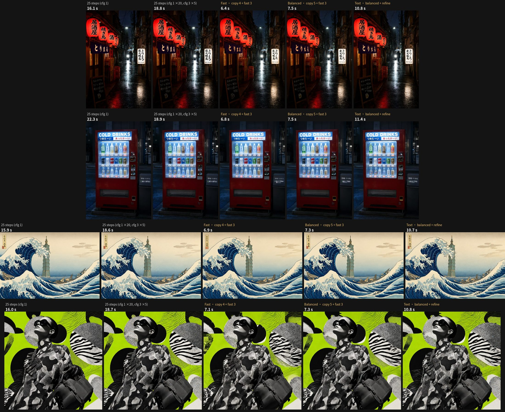

# ComfyUI Multi-Stage Sampler(多段取樣)

一個節點跑**多段取樣**:每段選原模型(base)或原模型 + fast/turbo LoRA(fast),可以照抄一般排程的某幾步、
或直接給 σ,每段各自設定 LoRA 強度、CFG、sampler、風格 LoRA 強度;最後一段還能加雜訊 refine。
全部寫成一份可以直接貼的 **JSON 配方**,節點裡內建編輯器。

取代原本要拉的 SplitSigmas、好幾個 SamplerCustomAdvanced / Guider / Noise,以及每段各一條、各自要接 LoRA 的 model 分支。

## 為什麼

蒸餾出來的 fast LoRA(例如 Qwen Image 2.1 的 Viggle turbo)構圖會跟原模型跑掉、細節會「刻」過頭。
讓**原模型照抄自己 25 步排程的前幾步**,構圖就跟 25 步那張一模一樣,再交給 fast LoRA 3 步收尾:

| 配方(Qwen Image 2.1 NVFP4,RTX 5060 Ti) | 時間 | 對 25 步的 LPIPS(平均 / 最差) |
|---|---|---|
| 25 步(參考) | ~19.7 秒 | – |
| 只用 Viggle turbo 6 步 | 7.0 秒 | 0.232 / 0.29 |
| **快** · 抄 4 + fast 3 | 6.6 秒 | 0.073 / 0.131 |
| **平衡** · 抄 5 + fast 3 | 7.7 秒 | 0.058 / 0.096 |
| **精** · 抄 6 + fast 3 | 8.5 秒 | 0.049 / 0.092 |
| **字** · 平衡 + 加雜訊 refine(σ 0.25、cfg 3) | 11.6 秒 | 招牌、標籤小字 |
| **字+** · 平衡 + 重 refine(σ 0.5、6 步、cfg 3) | 14.8 秒 | 極小手寫/狂草字 |


每一列同題目同 seed;前兩欄是一般 25 步(全程 cfg 1、以及前 20 步 cfg 1 + 後 5 步 cfg 3),後面是本節點的配方。Qwen Image 2.1 NVFP4、RTX 5060 Ti,時間含文字編碼與 VAE。

## 安裝

```
cd ComfyUI/custom_nodes
git clone https://github.com/pottokao-dotcom/ComfyUI-MultiStageSampler
```
不需要額外 Python 套件。QI2.1 + Viggle turbo 另外要:
- LoRA [`Qwen-Image-2.1-viggle-turbo-v0.2.1-6step-lora-r128.safetensors`](https://huggingface.co/Viggle/Qwen-Image-2.1-viggle-turbo) → `models/loras/`
- Viggle 的 `comfyui/viggle_turbo.py` → `custom_nodes/`。有它,fast LoRA 會「不合併」地套用(準確);沒有就退回 ComfyUI 標準(合併)方式。

範例:`examples/qwen_image_2_1_t2i_multistage.json` = ComfyUI 官方「Qwen Image 2.1 文生圖」範本,KSampler 換成本節點(含模型下載連結)。

## Z-Image base + Turbo(兩顆模型)

fast 那段如果是**另一顆模型**(Z-Image Turbo)而不是 LoRA,把它接到選接的 `fast_model` 輸入,fast 段就改用它(`fast_lora` 可以選 none,也可以再疊一個)。
配方 **Z-Image · base 2 + turbo 10**:base(+ Distill 8 步 LoRA 0.8)走 12 步 res_multistep 的前 2 步定構圖,Turbo 收後 10 步——跟兩個 KSamplerAdvanced 串接逐像素相同。
範例:`examples/z_image_base_turbo_multistage.json`(官方 Z-Image / Turbo 模型檔 + [alibaba-pai Distill LoRA](https://huggingface.co/alibaba-pai/Z-Image-Fun-Lora-Distill))。

配方 **Z-Image · sketch 1 + turbo 8**(最佳)與 **sketch 1 + turbo 6**(快速版):`model` 接「底稿」模型只畫第一步(σ 1→0.9,cfg 1)定構圖,再由 `fast_model` 的 Turbo 收尾。
底稿模型 = Z-Image base 合併 Distill 4 步 LoRA ×0.8,分層量化成 3 GB 的 Q2 GGUF——**在 [pottokao/Z-Image-Sketch-Q2_K-GGUF](https://huggingface.co/pottokao/Z-Image-Sketch-Q2_K-GGUF) 下載**(只給打草稿用,用 `UnetLoaderGGUF` 載入);也可以直接載 base + 這顆 LoRA 強度 0.8。範例:`examples/z_image_sketch_turbo_multistage.json`。
RTX 5060 Ti 每張 7.5 秒 / 6.6 秒;Turbo 少於 8 步,手指、菸這類細節開始出錯。

## 配方(JSON)

```json
{"name": "平衡", "stages": [
  {"model": "base", "scheduler": "simple", "steps": 25, "range": [0, 5]},
  {"model": "fast", "sigmas": [0.667, 0.4, 0], "lora": 0.93}
]}
```
- `model`:`base` 或 `fast`。
- `scheduler` + `steps` + `range: [a, b]`:照抄該排程第 a~b 步(跟 KSampler 走同一條路);或 `sigmas`:從上一段終點接著走到這些 σ。
- 選填:`lora`(fast 段強度)、`cfg`(>1 用 negative)、`sampler`、`styles`(這段 LORA_STACK 的倍率,0 = 不掛)、
  `noise: true`(先加新雜訊到 `sigmas[0]` 再走,收尾 refine 用)。

配方庫:`ComfyUI/user/multistage_recipes.json`(第一次啟動從 `recipes_default.json` 複製),節點的 preset 下拉就是它;選 `custom` 用節點上貼的配方。

## 編輯器(在節點裡)

分段表格、+ base / + fast / + refine、上下移、刪除;依計算量畫的流程條與預估秒數;
**合併**別的配方(整份接在後面 / 只接它的最後一段 / 取代我的最後一段);**另存配方 / 設為預設**寫回配方庫;
**改了就出圖**(seed 請設 fixed)。改預設配方時名稱會自動加「(改)」。介面跟著 ComfyUI 語言設定(英文、繁中、簡中)。

## 風格 / 人物 LoRA
1. 照平常接在 model 前面:每一段都會吃到,fast 段再自動疊上 fast LoRA。
2. 接 `LORA_STACK`(Efficiency / Comfyroll 格式,本包也附 **Multi-Stage LoRA Stack**),用每段的 `styles` 倍率調。
同一個 LoRA 不要兩邊都接,會套兩次。

## Bench(自動評估、自動挑配方)
見英文 README 的 Bench 一節;指令、指標、實驗結論相同。

## 授權
Apache-2.0
